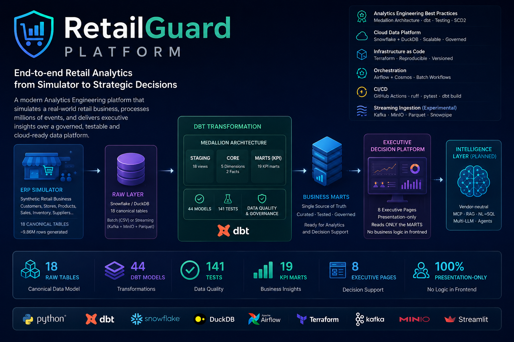

# RetailGuard Platform

<p align="center">
  
</p>

<p align="center">
  <strong>End-to-End Retail Data Platform · Analytics Engineering · Executive Decision Support</strong><br>
  Synthetic ERP → Snowflake · dbt → Business MARTS → Executive Decision Platform · 100% Infrastructure as Code
</p>

<p align="center">
  <!-- Badges: CI status · license · dbt · Snowflake -->
</p>

> **RetailGuard** turns raw transactional data from a realistic **ERP simulator** into governed, tested
> analytical models and an **Executive Decision Platform**. It demonstrates modern **Analytics
> Engineering** and **Data Platform** architecture: a dbt Medallion on **Snowflake**, provisioned 100% by
> **Terraform**, validated in **CI**, and served through an 8-page decision app that reads only the
> curated MARTS. Local development runs on **DuckDB** — no cloud cost, no credentials.

---

## Highlights

`ERP Simulator` · `Analytics Engineering` · `dbt Medallion` · `Snowflake + DuckDB` · `Executive Decision Platform` · `Infrastructure as Code` · `CI/CD` · `Airflow + Cosmos` · `Governance & FinOps` · `Vendor-neutral Intelligence Layer (roadmap)`

| | | | |
|---|---|---|---|
| **44** dbt models | **141** tests | **19** KPI marts | **8** executive pages |
| **18** staging views | **2** incremental facts | **1** SCD2 snapshot | **100%** IaC |

- **dbt Medallion** — staging → star schema → KPI marts, with **incremental MERGE** facts and a **real SCD2** snapshot.
- **Snowflake** provisioned 100% by **Terraform**; dev/CI parity on **DuckDB** — the same dbt models on both.
- **Executive Decision Platform** — Streamlit multipage, **presentation-only** (never recomputes a KPI).
- **Governance** (RBAC + Dynamic Data Masking on PII) and **FinOps** (credit metering) as first-class concerns.
- **CI/CD** — `ruff` → `pytest` → `dbt build` on an ephemeral DuckDB. No credentials.

---

## High-Level Architecture

```
ERP Simulator  →  RAW  →  dbt  →  Business MARTS  →  Executive Decision Platform  →  Intelligence Layer (planned)
```

Batch is the backbone. **Business logic lives entirely in dbt**; the serving layer only reads the MARTS.

---

## Project Goals

This is **not** a "look, I can use Snowflake" demo. It is designed to demonstrate:

- **Data Platform** — reliable ingestion → warehouse → governed models, reproducible via IaC.
- **Analytics Engineering** — dbt medallion, tests, incremental processing, SCD2, source freshness.
- **Decision Support** — an executive-grade serving layer that turns KPIs into decisions.
- **Cloud-ready architecture** — Snowflake in production, DuckDB for zero-cost local/CI, one codebase.

Design bias: a **smaller, correct, honest** platform over a large pile of tools.

---

## Technology Stack

| Category | Technologies |
|---|---|
| **Languages** | Python · SQL · Jinja |
| **Data Platform** | **dbt** (medallion, incremental, snapshots, tests, source freshness) · **Snowflake** (prod) · **DuckDB** (dev/CI) |
| **Infrastructure** | **Terraform** (full Snowflake bootstrap) · Docker |
| **Orchestration** | **Airflow** + astronomer-cosmos (batch lane, source-freshness gate) |
| **Serving** | **Streamlit** — Executive Decision Platform (`app/`) |
| **CI/CD** | **GitHub Actions** (ruff → pytest → dbt build on DuckDB) |
| **Governance / FinOps** | RBAC + Dynamic Data Masking · warehouse credit metering |
| **Streaming** *(experimental extension)* | Kafka (KRaft) → Parquet → MinIO — **not Core**, does not feed the platform |

---

## Executive Decision Platform

The serving layer ([`app/`](app/)) is a **Streamlit multipage** application — **8 executive pages** across
four sections. It is strictly a **presentation layer**:

- reads **only** the curated `MARTS` (Gold) built by dbt;
- **never** recomputes a KPI, re-derives a metric, or joins marts to replace one;
- **no business logic in the frontend** — all logic stays in dbt (single source of truth);
- KPIs not available at a mart's grain are surfaced as documented limitations, never hacked in Python.

| Section | Pages |
|---|---|
| 🎯 **Strategy** | Executive Cockpit |
| 📈 **Growth** | Revenue & Profit · Customer Intelligence |
| 🔗 **Operations** | Supply Chain · Inventory & Stock · Store Operations |
| 🛡️ **Governance** | Finance · Platform Health |

```bash
make platform   # → http://localhost:8501
```

<!-- Cockpit Screenshot -->
<!-- Revenue Screenshot -->

Per-page MARTS mapping in [docs/dashboard.md](docs/dashboard.md).

---

## Architecture

```
 Source (synthetic OLTP generator, Python)
        │  batch: CSV → source/
        ▼
 RAW        COPY INTO (Snowflake)  /  read_csv (DuckDB)
        │
        ▼
 dbt        staging (18 views) → Business MARTS (star schema + 19 KPI marts)
        │      · incremental MERGE on facts   · SCD2 snapshot on dim_customer
        ▼
 Serving    Executive Decision Platform  (app/ — Streamlit multipage, 8 pages, reads only MARTS)
        │      Snowflake-native deploy: snowflake/streamlit_app.py
        ▼
 Intelligence Layer (planned)  ·  vendor-neutral: MCP · RAG · NL→SQL · multi-LLM · agents

 Orchestration: Airflow + astronomer-cosmos (batch lane, with source-freshness gate)
 Infra:         Terraform provisions DB, schemas, warehouse, roles, RAW and stage
```

> **The source is a synthetic OLTP generator in Python** (`erp/`) modelling retail-ERP entities (sales,
> POs, invoices, accounts payable, inventory) — **it is not a PostgreSQL database**. In production, CDC
> over the real ERP would occupy this role. *(PostgreSQL appears only as Airflow's metadata store, never
> as a data source.)*

Full diagram, design decisions and data model: [docs/architecture.md](docs/architecture.md).

---

## Repository Structure

```
RetailGuard/
├── erp/            OLTP source — synthetic ERP simulator (Python)
├── scripts/        Batch loaders: CSV → DuckDB / Snowflake RAW
├── dbt/            Transformation: staging → marts · snapshots · tests
├── app/            Serving — Executive Decision Platform (Streamlit, 8 pages)
├── snowflake/      Snowflake-native deploy (streamlit_app.py) + platform SQL
├── airflow/        Airflow + cosmos (batch orchestration)
├── terraform/      IaC — full Snowflake bootstrap
├── extensions/     Outside the Core: streaming (experimental) · ai/ (Intelligence Layer, planned)
├── tests/          pytest
└── docs/           Architecture, deep-dives, and docs/adr (baseline)
```

---

## Quick Start

```bash
make setup       # Python deps + dbt packages (once, after clone)
make simulate    # generate synthetic data → source/*.csv
make load        # load CSVs into the DuckDB RAW layer
make build       # dbt build (staging → marts) — 187 nodes
make platform    # Executive Decision Platform → http://localhost:8501
```

Runs on a **clean clone** — no private files, no paid services (a reproducible 500-SKU synthetic catalogue
is used if the full Mercadona catalogue is absent).

**Production (Snowflake):** `make tf-apply` → `python scripts/load_snowflake_raw.py` →
`dbt build --target snowflake`. See [docs/deploy_runbook.md](docs/deploy_runbook.md).

---

## Roadmap

**Current**
- ✅ ERP Simulator (synthetic OLTP, deterministic, seed-reproducible)
- ✅ Data Platform (RAW → dbt Medallion → MARTS on Snowflake/DuckDB · IaC · CI)
- ✅ Executive Decision Platform (8 pages, presentation-only)

**Future — Intelligence Layer (vendor-neutral)**
- ☐ MCP server — read-only tools over MARTS (`query_mart`, `describe_model`, `list_kpis`)
- ☐ RAG over dbt metadata + docs
- ☐ NL→SQL — guardrails: SELECT-only, MARTS-only
- ☐ Agents · multi-LLM

---

## Design Principles

- **Single source of truth** — the dbt MARTS are the only Gold layer.
- **Business logic lives in dbt** — never in the serving/frontend.
- **Presentation-only serving** — the app reads and displays; it never recomputes.
- **Vendor-neutral evolution** — the Intelligence Layer avoids lock-in (no vendor-specific NL/AI).
- **Infrastructure as Code** — the whole Snowflake footprint is reproducible from Terraform.
- **Reproducible local development** — DuckDB gives full dev/CI parity at zero cost.

---

## Documentation

- **[docs/adr/](docs/adr)** — official architecture baseline (Core / Extensions, decisions, roadmap)
- [architecture.md](docs/architecture.md) · [incremental_and_scd2.md](docs/incremental_and_scd2.md) · [data_quality.md](docs/data_quality.md) · [governance.md](docs/governance.md) · [finops.md](docs/finops.md)
- [dashboard.md](docs/dashboard.md) — Executive Decision Platform · [deploy_runbook.md](docs/deploy_runbook.md) · [dynamic_tables.md](docs/dynamic_tables.md) *(extension)*
- [object_storage.md](docs/object_storage.md)

---

## Security

- `.env`, `terraform/terraform.tfvars`, `*.tfstate` and `~/.dbt/profiles.yml` are **never** committed.
- Snowflake credentials via env vars; `DBT_USER` uses **key-pair (JWT)** — only the public key is registered.
- Generated (`source/*.csv`) and scraped data are gitignored.

Dependencies pinned in [requirements.txt](requirements.txt).

---

## License

MIT © 2026 Welton Ferreira — see [LICENSE](LICENSE).
