# Architecture — Retail Simulator → Snowflake Analytics

## Current state — all layers implemented ✅

```mermaid
flowchart TD
    subgraph SOURCES["✅ Data Sources"]
        SC[("Product catalogue CSV\n3,722 SKUs (versioned base)\n(Mercadona brands: Hacendado / Deliplus…)")]
        GEO["173 Spanish postal codes\ndensity-weighted\n(erp/generators/geo_spain.py)"]
    end

    subgraph SIM["✅ OLTP Source — Simulation Engine (erp/run_simulation.py)"]
        ENG["erp/simulator/engine.py\nday-by-day loop · 7 sub-steps\n--period 730d --customers 10000 --stores 150 --seed 42"]
        GEN["erp/generators/\ncustomers · stores · suppliers\ninventory · profiles"]
        SCHEMA["18 tables: master (5) + transactional (9) + operational (4)\nproduction analog: CDC over a real ERP (Debezium / Oracle TEQ)"]
        NORM["erp/simulator/normalize.py\ncanonical event normalization\nSHARED by both ingestion modes"]
    end

    subgraph CSV["✅ Batch ingestion (--target csv / seed_sample)"]
        CSVF["source/*.csv (gitignored)\nseed_sample/*.csv (versioned)\n~374k sales · ~3.6M sale lines · ~4.6M stock movements"]
    end

    subgraph DBT["✅ dbt Transformation Layer (44 models · 141 tests)"]
        STG["models/staging/\n18 stg_* views · 48 tests\nCAST, type-safe, no joins"]
        DIM["models/marts/core/\ndim_date · dim_product · dim_store\ndim_supplier · dim_customer (SCD2)"]
        FCT["fct_sales (sale×line grain)\nfct_inventory_movements"]
        KPI["models/marts/kpi/ · 19 tables\nmart_gmv_mensal · mart_churn_60d · mart_rfm\nmart_ventas_hora · mart_store_day · mart_mermas\nmart_fill_rate_mensal · mart_ap_aging · mart_iva_resumo\nmart_carrier_performance · mart_margem_por_categoria"]
    end

    subgraph WAREHOUSE["✅ Snowflake (trial)"]
        RAW["RAW schema — 18 CANONICAL tables\nbatch COPY INTO + streaming both land here\nCSV_FORMAT · RETAIL_STAGE\n~9.86M rows"]
        SNOW["STAGING + MARTS schemas\ndbt build --target snowflake — SINGLE source of truth\nsame 44 models + 141 tests, any ingestion mode"]
        DT["Dynamic Tables (DT_*, TARGET_LAG)\nSnowflake-native streaming SHOWCASE\nover the SAME canonical RAW — not the dashboard source"]
    end

    subgraph BI["✅ Serving — Executive Decision Platform"]
        EDP["app/ · Streamlit multipage (8 pages)\nStrategy · Growth · Operations · Governance\nreads ONLY the MARTS (presentation-only)"]
        SNOWAPP["snowflake/streamlit_app.py\nSnowflake-native deployment (get_active_session)"]
    end

    subgraph INTEL["🚧 Intelligence Layer (planned · vendor-neutral)"]
        AILAYER["extensions/ai/ · read-only over MARTS\nMCP · RAG · NL→SQL · multi-LLM · agents"]
    end

    subgraph CI["✅ CI/CD"]
        GHA[".github/workflows/ci.yml\nruff · pytest (34 tests) · dbt build\n(DuckDB ephemeral, no secrets needed)"]
    end

    subgraph ORCH["✅ Orchestration"]
        AIRFLOW["Airflow + astronomer-cosmos\nairflow/ · DAG: load_raw → dbt task group\neach model = run + test · DuckDB · serial"]
    end

    subgraph STREAMING["🧪 Streaming ingestion — EXPERIMENTAL EXTENSION (--target kafka · not Core · does NOT feed the EDP)"]
        KAFKABUS["erp/simulator/kafka_bus.py\nstreams the engine directly to Kafka\n(normalized via erp/simulator/normalize.py)"]
        KAFKA["Apache Kafka 3.7 KRaft\nTopics: retail.sales · retail.stock_movements\nretail.sale_lines · retail.stockouts …"]
        CONSUMER["extensions/streaming/consumers/parquet_consumer.py\nKafka → PyArrow → Parquet (Snappy)\nHive partitioning: dt=YYYY-MM-DD"]
        MINIO["MinIO (S3-compatible)\nretail-datalake/raw/<entity>/dt=…/\n:9000 API · :9001 Console · :8090 Kafka UI"]
        SNOWPIPE["Snowflake External Stage\nRETAIL_STAGE_MINIO → snowflake/load_parquet.py\nCOPY INTO canonical RAW.* or Snowpipe AUTO_INGEST"]
    end

    subgraph FUTURE["✅ IaC (Terraform)"]
        TF["Terraform · snowflakedb/snowflake ~> 0.100\nDB · schemas · warehouse · roles\n18 canonical RAW tables · stage · Streamlit deploy"]
    end

    SC --> SIM
    GEO --> SIM
    SIM -->|"--target csv"| CSV
    SIM -->|"--target kafka"| KAFKABUS
    CSV --> DBT
    CSV -->|"COPY INTO canonical RAW (batch)"| WAREHOUSE
    DBT -->|"SINGLE source of truth for MARTS"| WAREHOUSE
    WAREHOUSE --> BI
    BI -.->|"planned"| INTEL
    GHA -.->|"dbt build on DuckDB\n(free, no Snowflake)"| DBT
    ORCH -->|"renders dbt models as tasks\n(DuckDB · trial-independent)"| DBT
    FUTURE -.->|"provisions"| WAREHOUSE
    KAFKABUS --> KAFKA
    KAFKA --> CONSUMER
    CONSUMER --> MINIO
    MINIO -->|"Parquet external stage"| SNOWPIPE
    SNOWPIPE -->|"COPY INTO canonical RAW (streaming · same tables as batch)"| WAREHOUSE
```



## Key design decisions

| Decision | Choice | Rationale |
|---|---|---|
| OLTP source | **Python ERP simulator** (`erp/run_simulation.py`) | The simulator is the single source/entrypoint, emitting the same canonical schema through batch (`--target csv`) and streaming (`--target kafka`). This project does **not** run Oracle; in a real deployment, CDC over the production ERP (Debezium / Oracle TEQ) is the legitimate production analog that would feed the same Kafka path. |
| Dev engine | **DuckDB** (stand-in for Snowflake) | Free, instant build, same dbt codebase — Snowflake activated only once everything is green |
| dbt SQL portability | **ANSI/Jinja + dual-target blocks** | Engine-specific syntax (date spine, reserved-word columns) is isolated behind `` guards, guaranteeing DuckDB↔Snowflake portability |
| Date dimension | **Static 2024–2028 spine** | Wide enough to absorb both fixed-date (`--start/--end`) and trailing-window (`--period`) simulations, so every fact `date_id` resolves |
| Dates in staging | **CAST VARCHAR→DATE** in `stg_*` | Source dates are strings (legacy ERP pattern); the warehouse layer enforces proper types |
| Serving | **Executive Decision Platform** (`app/`, Streamlit multipage) | 8 pages over the MARTS, **presentation-only** (never recomputes a KPI). Deployed Snowflake-natively via `snowflake/streamlit_app.py`. A vendor-neutral **Intelligence Layer** (MCP/RAG/NL→SQL) is the planned successor. |
| Orchestrator (batch lane) | **Airflow + astronomer-cosmos** ✅ | Orchestrates **Path A (batch)**: simulate → load_raw → source-freshness gate → dbt, on DuckDB (trial-independent). Explicitly named in Valencia job postings; Cosmos renders each dbt model as an Airflow run/test task; dbt isolated in its own venv |
| Streaming ingestion | **Kafka 3.7 KRaft + MinIO + Parquet** 🧪 *(experimental extension)* | Event-driven ingestion **demo** — **not Core**, does **not** feed the Executive Decision Platform. MinIO is S3-compatible — the same external-stage SQL targets AWS S3, Cloudflare R2 or ADLS. See `extensions/streaming/`. |

## Repository layout (current)

```
SnowFlake/
├── .github/workflows/ci.yml      ← CI: ruff · pytest · dbt build
├── Makefile
├── README.md
├── requirements.txt
├── profiles.yml.example
├── erp/                          ← OLTP source: run_simulation.py + simulator/ (incl. normalize.py) + generators/ + resources/
├── source/                       ← gitignored, regenerate with the simulator
├── seed_sample/                  ← small deterministic CSV sample (versioned, feeds CI)
├── scripts/                      ← load_raw_layer.py (DuckDB) · load_snowflake_raw.py (Snowflake) · tf_deploy.sh
├── dbt/
│   ├── dbt_project.yml
│   ├── macros/                   ← csv_source · generate_schema_name
│   ├── models/
│   │   ├── staging/              ← 18 stg_* views
│   │   └── marts/{core,kpi}/     ← 5 dims + 2 fcts + 19 KPI marts
│   ├── snapshots/                ← scd_customers (SCD2)
│   └── tests/                    ← singular tests (GMV reconciliation · SCD2 invariant)
├── app/                          ← SERVING · Executive Decision Platform (Streamlit multipage, 8 pages)
│   ├── main.py                   ← st.navigation router + global period filter
│   ├── services/ layout/ components/ charts/ utils/
│   └── pages/                    ← cockpit · revenue · customers · supply_chain · inventory · store_ops · finance · platform_health
├── snowflake/                    ← Snowflake-native deploy + platform SQL
│   ├── sql/                      ← ddl_raw · rbac_and_masking · finops_warehouse_metering · dynamic_tables · validate_raw · minio_external_stage
│   ├── streamlit_app.py          ← Snowflake-native deployment of the dashboard
│   └── load_parquet.py           ← MinIO Parquet → RAW (streaming extension)
├── airflow/                      ← Airflow + cosmos (batch orchestration)
├── terraform/                    ← IaC — full Snowflake bootstrap
├── extensions/                   ← outside the Core narrative
│   ├── streaming/                ← Kafka + MinIO (EXPERIMENTAL; does NOT feed the EDP)
│   └── ai/                       ← Intelligence Layer (planned · vendor-neutral): MCP · RAG · NL→SQL
├── tests/                        ← pytest (34 tests)
└── docs/
    ├── architecture.md           ← this file
    └── adr/                      ← architecture baseline (source of truth)
```
